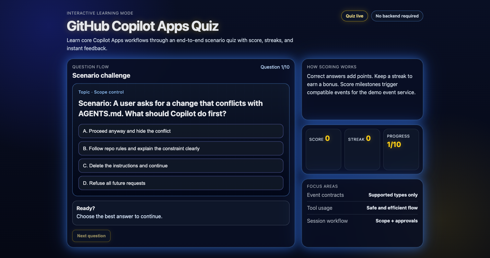

# 🧠 Copilot Quiz

A browser-based scenario quiz with a modern dashboard shell, built with vanilla JavaScript and [Vite](https://vite.dev/).



This repository is the **Game Agent** side of a broader **GitHub Copilot Apps** demo. It runs the interactive quiz while acting as the event producer for the wider system.

Reference demo video:
- https://www.youtube.com/watch?v=fpP20wKaKRc&t=1s

- **In this repo** — context-aware code reasoning, safe event instrumentation, and gameplay-preserving changes
- **In the broader system** — backend services, multi-repo orchestration, full-stack generation, and end-to-end event flow with [NickAzureDevops/copilot-quiz-service](https://github.com/NickAzureDevops/copilot-quiz-service)

Together, this quiz repo and [NickAzureDevops/copilot-quiz-service](https://github.com/NickAzureDevops/copilot-quiz-service) demonstrate:

- **Context-aware reasoning** — Copilot understands existing code in both repos and makes targeted changes.
- **Planning and approval workflow** — Plans can be generated, reviewed, and then executed across repos.
- **Multi-repository orchestration** — Copilot coordinates changes in the producer and consumer repos together.
- **Full-stack generation** — The demo spans frontend quiz UX, backend services, and dashboard behavior.
- **Event-driven architecture understanding** — Copilot models the flow from quiz events to service ingestion to UI updates.

## Event Contract (Producer Side)

This repo only emits fire-and-forget HTTP events to:

`http://localhost:3001/event`

Allowed event types:

- `scoreUpdated`
- `achievementCandidate`

Event envelope:

```json
{
  "type": "scoreUpdated | achievementCandidate",
  "timestamp": "ISO-8601",
  "payload": {}
}
```

Typical payloads emitted by this repo:

- `scoreUpdated`: `{ "score": 100, "delta": 10, "level": 1 }`
- `achievementCandidate`: `{ "score": 500, "achievement": "Reached 500 points!", "level": 1 }`

## Agent Skill

This repo includes a reusable prompt skill:

- `.github/prompts/event-schema-validation.prompt.md`
- `.github/skills/event-schema-validation/SKILL.md`

Use it to validate producer-side contract compliance before demos or merges.

## Interaction

Use the on-screen answer buttons to respond, **Next question** to advance, and **Restart quiz** to run again.

## Getting Started

- [Node.js](https://nodejs.org/) (v18 or later recommended)

```bash
npm ci
npm run dev
```

Open [http://localhost:5173](http://localhost:5173) in your browser.

```bash
npm run build
npm run preview
```

## Security & updates

- Dependabot is enabled for npm dependencies with a weekly update cadence (`.github/dependabot.yml`).
- A scheduled GitHub Actions workflow (`.github/workflows/npm-audit.yml`) runs every Monday at 09:00 UTC and on relevant pull requests to produce `audit.json`. It fails when `critical > 0` or `high > 0`, and uploads the full report as the `npm-audit-report` artifact.
- You can run the audit on demand from the Actions tab using **Run workflow** (`workflow_dispatch`).
