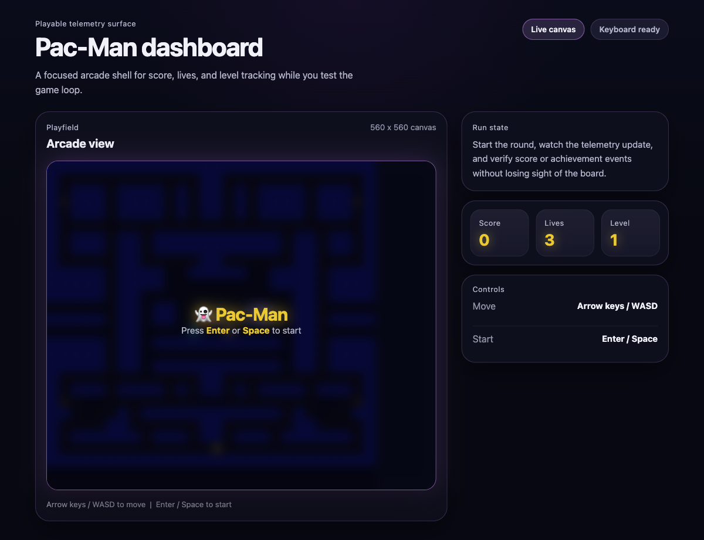

# 👻 Pac-Man Game

A browser-based Pac-Man game with a modern dashboard shell, built with vanilla JavaScript and [Vite](https://vite.dev/).



This repository is the **Game Agent** side of a broader **GitHub Copilot Apps** demo. It keeps Pac-Man playable while acting as the event producer for the wider system.

- **In this repo** — context-aware code reasoning, safe event instrumentation, and gameplay-preserving changes
- **In the broader system** — backend services, multi-repo orchestration, full-stack generation, and end-to-end event flow with [NickAzureDevops/pac-man-services](https://github.com/NickAzureDevops/pac-man-services)

## Controls

| Key | Action |
|-----|--------|
| `Arrow Keys` / `WASD` | Move Pac-Man |
| `Enter` / `Space` | Start / resume game |

## Getting Started

- [Node.js](https://nodejs.org/) (v18 or later recommended)

```bash
npm ci
npm run dev
```

Open [http://localhost:5173](http://localhost:5173) in your browser.

```bash
npm run build
npm run preview
```
